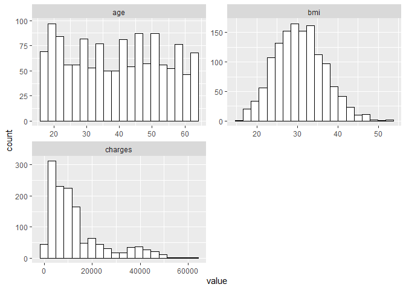
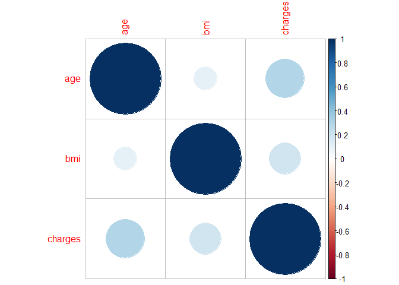

# ДЗ 2. Анализ данных стоимости медобслуживания пациентов (Medical Cost Personal Datasets)

## Винник Екатерина Петровна, 22.М04

    library(readr)
    options(readr.show_col_types = FALSE)
    insurance_data <- read_csv("data/insurance.csv")
    print(insurance_data)

    ## # A tibble: 1,338 × 7
    ##      age sex      bmi children smoker region    charges
    ##    <dbl> <chr>  <dbl>    <dbl> <chr>  <chr>       <dbl>
    ##  1    19 female  27.9        0 yes    southwest  16885.
    ##  2    18 male    33.8        1 no     southeast   1726.
    ##  3    28 male    33          3 no     southeast   4449.
    ##  4    33 male    22.7        0 no     northwest  21984.
    ##  5    32 male    28.9        0 no     northwest   3867.
    ##  6    31 female  25.7        0 no     southeast   3757.
    ##  7    46 female  33.4        1 no     southeast   8241.
    ##  8    37 female  27.7        3 no     northwest   7282.
    ##  9    37 male    29.8        2 no     northeast   6406.
    ## 10    60 female  25.8        0 no     northwest  28923.
    ## # ℹ 1,328 more rows

## Построение гистограмм частот непрерывных признаков

В датасете имеются следующие непрерывные признаки:

-   возраст (age)
-   индекс массы тела (bmi)
-   количество детей (children)
-   расходы (charges)

Построим гистограмммы частот для всех этих признаков:

    library(ggplot2)
    library(dplyr)

    ## 
    ## Присоединяю пакет: 'dplyr'

    ## Следующие объекты скрыты от 'package:stats':
    ## 
    ##     filter, lag

    ## Следующие объекты скрыты от 'package:base':
    ## 
    ##     intersect, setdiff, setequal, union

    library(tidyr)

    insurance_data %>% select_if(is.numeric) %>% pivot_longer(1:4, values_to="value", names_to="names") %>% ggplot() + geom_histogram(aes(x = value), bins = 20, colour = "black", fill = "white") + facet_wrap(~ names, scales = "free", ncol=2)

 На
гистограммах выше можно отметить, что среди множеств значений `bmi` и
`charges` есть три наблюдения, которые имеют значения, большие, чем
основная масса наблюдений.

    insurance_data %>% select(bmi, charges)  %>% tidyr::pivot_longer(1:2, values_to="value", names_to="names") %>% 
      ggplot() + geom_histogram(aes(x = value), bins = 100, colour = "black", fill = "white") + facet_wrap(~ names, scales = "free", ncol=2)

Найдем номера этих наблюдений:

    which(insurance_data$charges > 59000)

    ## [1]  544 1231 1301

    which(insurance_data$bmi > 50)

    ## [1]  848 1048 1318

Таким образом, для признака `charges` это номера 544, 1231, 1301, а для
признака `bmi` это номера 848, 1048, 1318. При построении модели
машинного обучения может быть осмысленно счесть эти значения выбросами.

## Сравнение выраженности непрерывных признаков между группами мужчин и женщин

Сравним, насколько выражены непрерывные признаки среди группы мужчин по
сравнению с группой женщин. Для сравнения воспользуемся статистическим
критерием. Будем использовать t-критерий Стьюдента, так как признаки,
измеренные в выборке, являются непрерывными, а ключевая переменная пол
(т.е. главная переменная для решения поставленной задачи) —
качественной.

### Индекс массы тела (bmi)

    ggplot(aes(x=bmi, fill = sex), data=insurance_data) + 
      geom_boxplot() + 
      labs(x = "bmi",title="Зависимость показателя индекса массы тела от пола") + 
      theme_bw()

**Нулевая гипотеза**: среднее значение индекса массы тела не отличается
для групп мужчин и женщин.

    t.test(insurance_data$bmi ~ insurance_data$sex, paired=FALSE)

    ## 
    ##  Welch Two Sample t-test
    ## 
    ## data:  insurance_data$bmi by insurance_data$sex
    ## t = -1.697, df = 1336, p-value = 0.08992
    ## alternative hypothesis: true difference in means between group female and group male is not equal to 0
    ## 95 percent confidence interval:
    ##  -1.21895043  0.08819153
    ## sample estimates:
    ## mean in group female   mean in group male 
    ##             30.37775             30.94313

Так как p-значение (0.09) больше выбранного уровня значимости (0.05),
нулевая гипотеза принимается. Таким образом, различия между
рассматриваемыми группами мужчин и женщин по показателю индекс массы
тела не являются значимыми.

### Возраст (age)

    ggplot(aes(x=age, fill = sex), data=insurance_data) + 
      geom_boxplot() + 
      labs(x = "age",title="Зависимость показателя возраста от пола") + 
      theme_bw()

**Нулевая гипотеза**: среднее значение возраста не различается для групп
мужчин и женщин.

    t.test(insurance_data$age ~ insurance_data$sex, paired=FALSE)

    ## 
    ##  Welch Two Sample t-test
    ## 
    ## data:  insurance_data$age by insurance_data$sex
    ## t = 0.76247, df = 1335.4, p-value = 0.4459
    ## alternative hypothesis: true difference in means between group female and group male is not equal to 0
    ## 95 percent confidence interval:
    ##  -0.9214814  2.0932042
    ## sample estimates:
    ## mean in group female   mean in group male 
    ##             39.50302             38.91716

Так как p-значение (0.45) больше выбранного уровня значимости (0.05),
нулевая гипотеза принимается. Таким образом, различия между
рассматриваемыми группами мужчин и женщин по показателю возраст не
являются значимыми.

### Количество детей (children)

    ggplot(aes(x=children, fill = sex), data=insurance_data) + 
      geom_boxplot() + 
      labs(x = "charges",title="Зависимость показателя количества детей от пола") + 
      theme_bw()

**Нулевая гипотеза**: среднее значение количества детей не отличается
для групп мужчин и женщин.

    t.test(insurance_data$children ~ insurance_data$sex, paired=FALSE)

    ## 
    ##  Welch Two Sample t-test
    ## 
    ## data:  insurance_data$children by insurance_data$sex
    ## t = -0.62757, df = 1336, p-value = 0.5304
    ## alternative hypothesis: true difference in means between group female and group male is not equal to 0
    ## 95 percent confidence interval:
    ##  -0.17067562  0.08794264
    ## sample estimates:
    ## mean in group female   mean in group male 
    ##             1.074018             1.115385

Так как p-значение (0.53) больше выбранного уровня значимости (0.05),
нулевая гипотеза принимается. Таким образом, различия между
рассматриваемыми группами мужчин и женщин по показателю количество детей
не являются значимыми.

### Расходы (charges)

    ggplot(aes(x=charges, fill = sex), data=insurance_data) + 
      geom_boxplot() + 
      labs(x = "charges",title="Зависимость показателя расходов от пола") + 
      theme_bw()

**Нулевая гипотеза**: среднее значение расходов не отличается для групп
мужчин и женщин.

    t.test(insurance_data$charges ~ insurance_data$sex, paired=FALSE)

    ## 
    ##  Welch Two Sample t-test
    ## 
    ## data:  insurance_data$charges by insurance_data$sex
    ## t = -2.1009, df = 1313.4, p-value = 0.03584
    ## alternative hypothesis: true difference in means between group female and group male is not equal to 0
    ## 95 percent confidence interval:
    ##  -2682.48932   -91.85535
    ## sample estimates:
    ## mean in group female   mean in group male 
    ##             12569.58             13956.75

Так как p-значение (0.04) меньше выбранного уровня значимости (0.05),
нулевая гипотеза отвергается. Таким образом, различия между
рассматриваемыми группами мужчин и женщин по показателю расходы являются
значимыми.

### Выводы

Таким образом, можно сказать, что: - различия между мужчинами и
женщинами по непрерывному признаку расходы (charges) являются
значимыми - различия по остальным признакам: возраст (age), количество
детей (children), индекс массы тела (bmi) не являются значимыми

## Анализ коррелляций непрерывных признаков

    library(corrplot)

    ## corrplot 0.92 loaded

    insurance_data <- insurance_data %>% mutate(children = as.numeric(children))
    insurance_data

    ## # A tibble: 1,338 × 7
    ##      age sex      bmi children smoker region    charges
    ##    <dbl> <chr>  <dbl>    <dbl> <chr>  <chr>       <dbl>
    ##  1    19 female  27.9        0 yes    southwest  16885.
    ##  2    18 male    33.8        1 no     southeast   1726.
    ##  3    28 male    33          3 no     southeast   4449.
    ##  4    33 male    22.7        0 no     northwest  21984.
    ##  5    32 male    28.9        0 no     northwest   3867.
    ##  6    31 female  25.7        0 no     southeast   3757.
    ##  7    46 female  33.4        1 no     southeast   8241.
    ##  8    37 female  27.7        3 no     northwest   7282.
    ##  9    37 male    29.8        2 no     northeast   6406.
    ## 10    60 female  25.8        0 no     northwest  28923.
    ## # ℹ 1,328 more rows

Посмотрим на корреляции признаков.

    plotCor <- corrplot(cor(insurance_data %>% select_if(is.numeric)))

Из матрицы корреляций видно, что:

-   признаки age и charges коррелируют;
-   также коррелируют и признаки bmi и charges;
-   остальные пары признаков коррелируют в меньшей степени;
-   совсем не коррелируют признаки children и bmi – их корреляция равна
    0 (что кажется логичным, так как индекс массы тела не зависит от
    количества детей).

Используем статистический вывод для установления зависимости
коррелирующих переменных. Положим уровень значимости равным 0.05.

#### Корреляция переменных age и charges

**Нулевая гипотеза**: коэффициент корреляции между переменными `age` и
`charges` равен нулю.

    cor.test(insurance_data$age, insurance_data$charges)

    ## 
    ##  Pearson's product-moment correlation
    ## 
    ## data:  insurance_data$age and insurance_data$charges
    ## t = 11.453, df = 1336, p-value < 2.2e-16
    ## alternative hypothesis: true correlation is not equal to 0
    ## 95 percent confidence interval:
    ##  0.2494139 0.3470381
    ## sample estimates:
    ##       cor 
    ## 0.2990082

Статистика критерия равна 11.45 (1336 степеней свободы), p-value &lt;
0.05. Таким образом, гипотеза о равенстве нулю коэффициента корреляции
не принимается на выбранном уровне значимости.

#### Корреляция переменных bmi и charges

**Нулевая гипотеза**: коэффициент корреляции между переменными `bmi` и
`charges` равен нулю.

    cor.test(insurance_data$bmi, insurance_data$charges)

    ## 
    ##  Pearson's product-moment correlation
    ## 
    ## data:  insurance_data$bmi and insurance_data$charges
    ## t = 7.3966, df = 1336, p-value = 2.459e-13
    ## alternative hypothesis: true correlation is not equal to 0
    ## 95 percent confidence interval:
    ##  0.1463052 0.2492822
    ## sample estimates:
    ##      cor 
    ## 0.198341

Статистика критерия равна 7.39 (1336 степеней свободы), p-value &lt;
0.05. Таким образом, гипотеза о равенстве нулю коэффициента корреляции
не принимается на выбранном уровне значимости.

#### Корреляция переменных age и children

**Нулевая гипотеза**: коэффициент корреляции между переменными `age` и
`children` равен нулю.

    cor.test(insurance_data$age, insurance_data$children)

    ## 
    ##  Pearson's product-moment correlation
    ## 
    ## data:  insurance_data$age and insurance_data$children
    ## t = 1.5537, df = 1336, p-value = 0.1205
    ## alternative hypothesis: true correlation is not equal to 0
    ## 95 percent confidence interval:
    ##  -0.01114729  0.09584178
    ## sample estimates:
    ##      cor 
    ## 0.042469

Статистика критерия равна 1.55 (1336 степеней свободы), p-value &gt;
0.05. Таким образом, гипотеза о равенстве нулю коэффициента корреляции
не отвергается на выбранном уровне значимости. Это согласуется со
значением корреляции для пары этих признаков, близким к нулю, на
графике.

#### Корреляция переменных bmi и children

**Нулевая гипотеза**: коэффициент корреляции между переменными `bmi` и
`children` равен нулю.

    cor.test(insurance_data$bmi, insurance_data$children)

    ## 
    ##  Pearson's product-moment correlation
    ## 
    ## data:  insurance_data$bmi and insurance_data$children
    ## t = 0.46639, df = 1336, p-value = 0.641
    ## alternative hypothesis: true correlation is not equal to 0
    ## 95 percent confidence interval:
    ##  -0.04085995  0.06630448
    ## sample estimates:
    ##       cor 
    ## 0.0127589

Статистика критерия равна 0.46 (1336 степеней свободы), p-value &gt;
0.05. Таким образом, гипотеза о равенстве нулю коэффициента корреляции
не отвергается на выбранном уровне значимости. Это согласуется со
значением корреляции для пары этих признаков, близким к нулю, на
графике.

#### Корреляция переменных age и bmi

**Нулевая гипотеза**: коэффициент корреляции между переменными `age` и
`bmi` равен нулю.

    cor.test(insurance_data$age, insurance_data$bmi)

    ## 
    ##  Pearson's product-moment correlation
    ## 
    ## data:  insurance_data$age and insurance_data$bmi
    ## t = 4.0181, df = 1336, p-value = 6.194e-05
    ## alternative hypothesis: true correlation is not equal to 0
    ## 95 percent confidence interval:
    ##  0.05600895 0.16191463
    ## sample estimates:
    ##       cor 
    ## 0.1092719

Статистика критерия равна 4.02 (1336 степеней свободы), p-value &lt;
0.05. Таким образом, гипотеза о равенстве нулю коэффициента корреляции
не принимается на выбранном уровне значимости.

#### Корреляция переменных charges и children

**Нулевая гипотеза**: коэффициент корреляции между переменными
`children` и `charges` равен нулю.

    cor.test(insurance_data$children, insurance_data$charges)

    ## 
    ##  Pearson's product-moment correlation
    ## 
    ## data:  insurance_data$children and insurance_data$charges
    ## t = 2.4912, df = 1336, p-value = 0.01285
    ## alternative hypothesis: true correlation is not equal to 0
    ## 95 percent confidence interval:
    ##  0.0144600 0.1211477
    ## sample estimates:
    ##        cor 
    ## 0.06799823

Статистика критерия равна 2.49 (1336 степеней свободы), p-value &lt;
0.05. Таким образом, гипотеза о равенстве нулю коэффициента корреляции
не принимается на выбранном уровне значимости.
