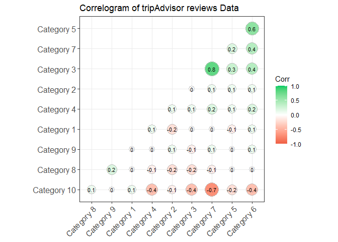
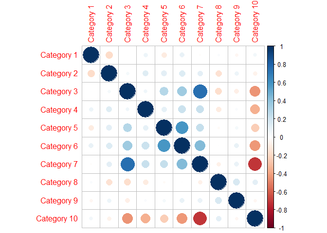
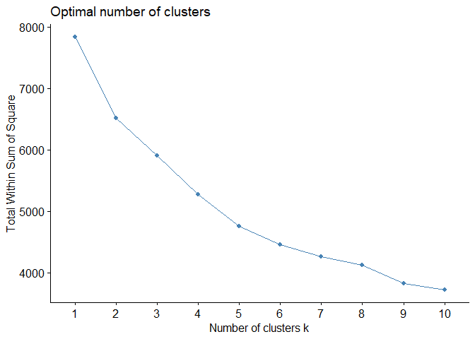
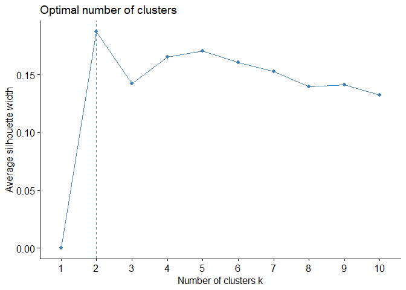
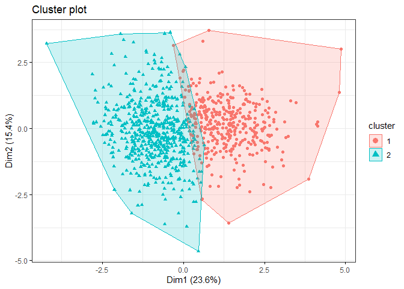
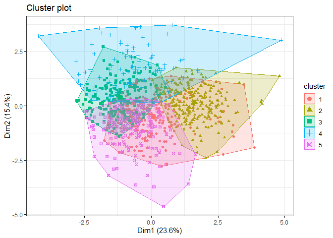
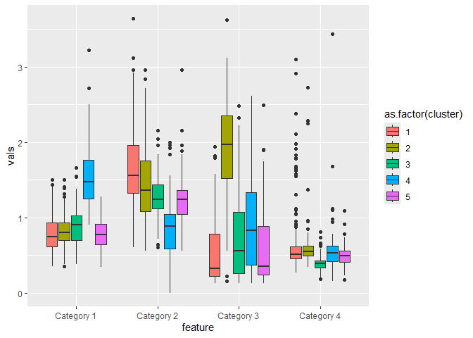
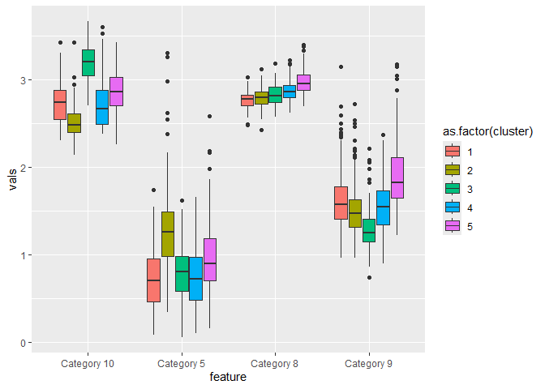
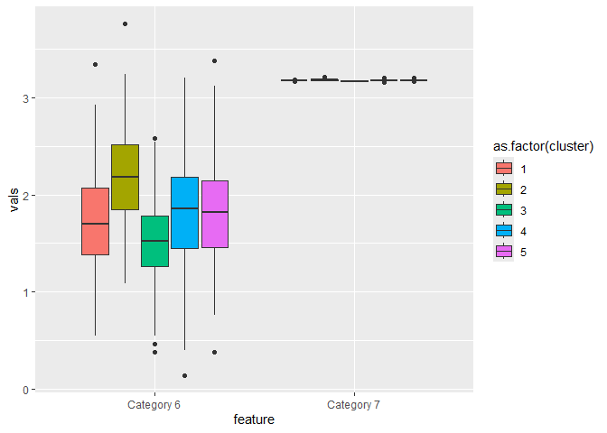
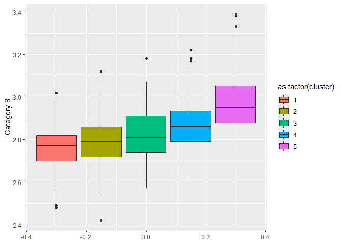

# ДЗ 3. Кластеризация данных отзывов о путешествиях

## Винник Екатерина Петровна, 22.М04

Загрузим данные.

    library(readr)
    options(readr.show_col_types = FALSE)
    review_data <- read_csv("data/tripadvisor_review.csv")
    print(review_data)

    ## # A tibble: 980 × 11
    ##    `User ID` `Category 1` `Category 2` `Category 3` `Category 4` `Category 5`
    ##    <chr>            <dbl>        <dbl>        <dbl>        <dbl>        <dbl>
    ##  1 User 1            0.93         1.8          2.29         0.62         0.8 
    ##  2 User 2            1.02         2.2          2.66         0.64         1.42
    ##  3 User 3            1.22         0.8          0.54         0.53         0.24
    ##  4 User 4            0.45         1.8          0.29         0.57         0.46
    ##  5 User 5            0.51         1.2          1.18         0.57         1.54
    ##  6 User 6            0.99         1.28         0.72         0.27         0.74
    ##  7 User 7            0.9          1.36         0.26         0.32         0.86
    ##  8 User 8            0.74         1.4          0.22         0.41         0.82
    ##  9 User 9            1.12         1.76         1.04         0.64         0.82
    ## 10 User 10           0.7          1.36         0.22         0.26         1.5 
    ## # ℹ 970 more rows
    ## # ℹ 5 more variables: `Category 6` <dbl>, `Category 7` <dbl>,
    ## #   `Category 8` <dbl>, `Category 9` <dbl>, `Category 10` <dbl>

## Анализ корреляций

В датасете есть 10 локаций (категорий), каждой категории пользователь,
обладающий User ID, выставляет оценку от Excellent(4), Very Good(3),
Average(2), Poor(1), and Terrible(0).

    review_data_mod <- as.data.frame(scale(review_data[,2:11]))
    head(review_data_mod)

    ##   Category 1 Category 2 Category 3   Category 4 Category 5 Category 6
    ## 1  0.1125872  0.9354094  1.6189231  0.312800143 -0.3194447  1.0696225
    ## 2  0.3878904  1.7717393  2.0881049  0.384297318  1.0979250  2.4782350
    ## 3  0.9996754 -1.1554154 -0.6001801 -0.008937147 -1.5996497 -0.5614024
    ## 4 -1.3556968  0.9354094 -0.9171948  0.134057204 -1.0967120 -0.5984712
    ## 5 -1.1721613 -0.3190855  0.2113777  0.134057204  1.3722547  0.3282476
    ## 6  0.2961227 -0.1518195 -0.3719295 -0.938400429 -0.4566095 -1.0803649
    ##   Category 7 Category 8   Category 9 Category 10
    ## 1  1.1580656 -0.3277049  0.687166716  -1.1799885
    ## 2  3.7141565 -1.4912948  0.796867124  -1.4911467
    ## 3 -0.1199798 -0.2549805 -0.711513490  -0.9310618
    ## 4 -0.1199798  0.9086094  0.001539164   0.1891080
    ## 5 -0.1199798 -0.4004293 -1.068039817  -0.8065985
    ## 6 -1.3980252  0.3995388  0.248365083   2.6783744

Проанализируем корреляции отзывов о различных локациях путешествий.

    library(ggcorrplot)

    ## Warning: пакет 'ggcorrplot' был собран под R версии 4.3.3

    ## Загрузка требуемого пакета: ggplot2

    corr_scaled <- round(cor(review_data_mod),1)

    ggcorrplot(corr_scaled, hc.order = TRUE, 
               type = "lower", 
               lab = TRUE, 
               lab_size = 3, 
               method="circle", 
               colors = c("tomato2", "white", "springgreen3"), 
               title="Correlogram of tripAdvisor reviews Data", 
               ggtheme=theme_bw)

Также построим матрицу корреляций Пирсона. Видно, что обе матрицы
согласуются между собой – сильно коррелируют признаки Category 7 и
Category 3 (коэффициент корреляции составляет 0.8), Category 6 и
Category 5 (коэффициент корреляции составляет 0.6), Category 7 и
Category 6 (коэффициент корреляции составляет 0.4).

    corrplot::corrplot(cor(review_data_mod, method="pearson"))

Таким образом, в имеющемся датасете присутствуют коррелированные
признаки, определим те, которые наиболее коррелированы с остальными.

    a<-caret::findCorrelation(corr_scaled, cutoff = 0.59, verbose = T)

    ## Compare row 7  and column  10 with corr  0.7 
    ##   Means:  0.289 vs 0.163 so flagging column 7 
    ## Compare row 6  and column  5 with corr  0.6 
    ##   Means:  0.238 vs 0.141 so flagging column 6 
    ## All correlations <= 0.59

    print("---Column name we want to remove---")

    ## [1] "---Column name we want to remove---"

    colnames(review_data_mod)[a]

    ## [1] "Category 7" "Category 6"

Так как признаки Category 7 и Category 6 сильно коррелируют с
остальными, их можно удалить из датасета. Удалим их из датасета.

    library(dplyr)

    ## 
    ## Присоединяю пакет: 'dplyr'

    ## Следующие объекты скрыты от 'package:stats':
    ## 
    ##     filter, lag

    ## Следующие объекты скрыты от 'package:base':
    ## 
    ##     intersect, setdiff, setequal, union

    review_data_mod <- as.data.frame(review_data_mod) %>% select(-"Category 6", -"Category 7")

Таким образом, при дальнейшем анализе будет использоваться следующий
датасет без признаков Category 6, Category 7.

    head(review_data_mod)

    ##   Category 1 Category 2 Category 3   Category 4 Category 5 Category 8
    ## 1  0.1125872  0.9354094  1.6189231  0.312800143 -0.3194447 -0.3277049
    ## 2  0.3878904  1.7717393  2.0881049  0.384297318  1.0979250 -1.4912948
    ## 3  0.9996754 -1.1554154 -0.6001801 -0.008937147 -1.5996497 -0.2549805
    ## 4 -1.3556968  0.9354094 -0.9171948  0.134057204 -1.0967120  0.9086094
    ## 5 -1.1721613 -0.3190855  0.2113777  0.134057204  1.3722547 -0.4004293
    ## 6  0.2961227 -0.1518195 -0.3719295 -0.938400429 -0.4566095  0.3995388
    ##     Category 9 Category 10
    ## 1  0.687166716  -1.1799885
    ## 2  0.796867124  -1.4911467
    ## 3 -0.711513490  -0.9310618
    ## 4  0.001539164   0.1891080
    ## 5 -1.068039817  -0.8065985
    ## 6  0.248365083   2.6783744

## Определение оптимального числа кластеров

Построим графики средней ширины силуэтов и WSS, чтобы определить наличие
кластеров в датасете.

    library(factoextra)

    ## Warning: пакет 'factoextra' был собран под R версии 4.3.3

    ## Welcome! Want to learn more? See two factoextra-related books at https://goo.gl/ve3WBa

    fviz_nbclust(review_data_mod, kmeans, method="wss")

    fviz_nbclust(review_data_mod, kmeans, method="silhouette")

Графики средней ширины силуэтов и WSS позволяют предположить наличие 2
или 5 кластеров в датасете.

## Разбиение на кластеры

Визуализируем кластеры в данных, определяемые алгоритмом KMeans для 2 и
5 кластеров, полученных при анализе ранее.

    clus_res_2 <- kmeans(review_data_mod, 2)
    fviz_cluster(clus_res_2, review_data_mod, stand = FALSE,
    geom = "point", ggtheme = theme_bw())

    clus_res_5 <- kmeans(review_data_mod, 5)
    fviz_cluster(clus_res_5, review_data_mod, stand = FALSE,
    geom = "point", ggtheme = theme_bw())

 \##
Устойчивость кластеров

Определим оптимальное число кластеров при помощи анализа устойчивости
кластеров (на основе формирования подвыборок из исходной выборки).

    library(fpc)

    ## Warning: пакет 'fpc' был собран под R версии 4.3.3

    clboo_res_2 <- fpc::clusterboot(review_data_mod,B=100,bootmethod=c("boot"),clustermethod=kmeansCBI,k=2)

    ## boot 1 
    ## boot 2 
    ## boot 3 
    ## boot 4 
    ## boot 5 
    ## boot 6 
    ## boot 7 
    ## boot 8 
    ## boot 9 
    ## boot 10 
    ## boot 11 
    ## boot 12 
    ## boot 13 
    ## boot 14 
    ## boot 15 
    ## boot 16 
    ## boot 17 
    ## boot 18 
    ## boot 19 
    ## boot 20 
    ## boot 21 
    ## boot 22 
    ## boot 23 
    ## boot 24 
    ## boot 25 
    ## boot 26 
    ## boot 27 
    ## boot 28 
    ## boot 29 
    ## boot 30 
    ## boot 31 
    ## boot 32 
    ## boot 33 
    ## boot 34 
    ## boot 35 
    ## boot 36 
    ## boot 37 
    ## boot 38 
    ## boot 39 
    ## boot 40 
    ## boot 41 
    ## boot 42 
    ## boot 43 
    ## boot 44 
    ## boot 45 
    ## boot 46 
    ## boot 47 
    ## boot 48 
    ## boot 49 
    ## boot 50 
    ## boot 51 
    ## boot 52 
    ## boot 53 
    ## boot 54 
    ## boot 55 
    ## boot 56 
    ## boot 57 
    ## boot 58 
    ## boot 59 
    ## boot 60 
    ## boot 61 
    ## boot 62 
    ## boot 63 
    ## boot 64 
    ## boot 65 
    ## boot 66 
    ## boot 67 
    ## boot 68 
    ## boot 69 
    ## boot 70 
    ## boot 71 
    ## boot 72 
    ## boot 73 
    ## boot 74 
    ## boot 75 
    ## boot 76 
    ## boot 77 
    ## boot 78 
    ## boot 79 
    ## boot 80 
    ## boot 81 
    ## boot 82 
    ## boot 83 
    ## boot 84 
    ## boot 85 
    ## boot 86 
    ## boot 87 
    ## boot 88 
    ## boot 89 
    ## boot 90 
    ## boot 91 
    ## boot 92 
    ## boot 93 
    ## boot 94 
    ## boot 95 
    ## boot 96 
    ## boot 97 
    ## boot 98 
    ## boot 99 
    ## boot 100

    clboo_res_4 <- fpc::clusterboot(review_data_mod,B=100,bootmethod=c("boot"),clustermethod=kmeansCBI,k=4)

    ## boot 1 
    ## boot 2 
    ## boot 3 
    ## boot 4 
    ## boot 5 
    ## boot 6 
    ## boot 7 
    ## boot 8 
    ## boot 9 
    ## boot 10 
    ## boot 11 
    ## boot 12 
    ## boot 13 
    ## boot 14 
    ## boot 15 
    ## boot 16 
    ## boot 17 
    ## boot 18 
    ## boot 19 
    ## boot 20 
    ## boot 21 
    ## boot 22 
    ## boot 23 
    ## boot 24 
    ## boot 25 
    ## boot 26 
    ## boot 27 
    ## boot 28 
    ## boot 29 
    ## boot 30 
    ## boot 31 
    ## boot 32 
    ## boot 33 
    ## boot 34 
    ## boot 35 
    ## boot 36 
    ## boot 37 
    ## boot 38 
    ## boot 39 
    ## boot 40 
    ## boot 41 
    ## boot 42 
    ## boot 43 
    ## boot 44 
    ## boot 45 
    ## boot 46 
    ## boot 47 
    ## boot 48 
    ## boot 49 
    ## boot 50 
    ## boot 51 
    ## boot 52 
    ## boot 53 
    ## boot 54 
    ## boot 55 
    ## boot 56 
    ## boot 57 
    ## boot 58 
    ## boot 59 
    ## boot 60 
    ## boot 61 
    ## boot 62 
    ## boot 63 
    ## boot 64 
    ## boot 65 
    ## boot 66 
    ## boot 67 
    ## boot 68 
    ## boot 69 
    ## boot 70 
    ## boot 71 
    ## boot 72 
    ## boot 73 
    ## boot 74 
    ## boot 75 
    ## boot 76 
    ## boot 77 
    ## boot 78 
    ## boot 79 
    ## boot 80 
    ## boot 81 
    ## boot 82 
    ## boot 83 
    ## boot 84 
    ## boot 85 
    ## boot 86 
    ## boot 87 
    ## boot 88 
    ## boot 89 
    ## boot 90 
    ## boot 91 
    ## boot 92 
    ## boot 93 
    ## boot 94 
    ## boot 95 
    ## boot 96 
    ## boot 97 
    ## boot 98 
    ## boot 99 
    ## boot 100

    clboo_res_5 <- fpc::clusterboot(review_data_mod,B=100,bootmethod=c("boot"),clustermethod=kmeansCBI,k=5)

    ## boot 1 
    ## boot 2 
    ## boot 3 
    ## boot 4 
    ## boot 5 
    ## boot 6 
    ## boot 7 
    ## boot 8 
    ## boot 9 
    ## boot 10 
    ## boot 11 
    ## boot 12 
    ## boot 13 
    ## boot 14 
    ## boot 15 
    ## boot 16 
    ## boot 17 
    ## boot 18 
    ## boot 19 
    ## boot 20 
    ## boot 21 
    ## boot 22 
    ## boot 23 
    ## boot 24 
    ## boot 25 
    ## boot 26 
    ## boot 27 
    ## boot 28 
    ## boot 29 
    ## boot 30 
    ## boot 31 
    ## boot 32 
    ## boot 33 
    ## boot 34 
    ## boot 35 
    ## boot 36 
    ## boot 37 
    ## boot 38 
    ## boot 39 
    ## boot 40 
    ## boot 41 
    ## boot 42 
    ## boot 43 
    ## boot 44 
    ## boot 45 
    ## boot 46 
    ## boot 47 
    ## boot 48 
    ## boot 49 
    ## boot 50 
    ## boot 51 
    ## boot 52 
    ## boot 53 
    ## boot 54 
    ## boot 55 
    ## boot 56 
    ## boot 57 
    ## boot 58 
    ## boot 59 
    ## boot 60 
    ## boot 61 
    ## boot 62 
    ## boot 63 
    ## boot 64 
    ## boot 65 
    ## boot 66 
    ## boot 67 
    ## boot 68 
    ## boot 69 
    ## boot 70 
    ## boot 71 
    ## boot 72 
    ## boot 73 
    ## boot 74 
    ## boot 75 
    ## boot 76 
    ## boot 77 
    ## boot 78 
    ## boot 79 
    ## boot 80 
    ## boot 81 
    ## boot 82 
    ## boot 83 
    ## boot 84 
    ## boot 85 
    ## boot 86 
    ## boot 87 
    ## boot 88 
    ## boot 89 
    ## boot 90 
    ## boot 91 
    ## boot 92 
    ## boot 93 
    ## boot 94 
    ## boot 95 
    ## boot 96 
    ## boot 97 
    ## boot 98 
    ## boot 99 
    ## boot 100

    clboo_res_6 <- fpc::clusterboot(review_data_mod,B=100,bootmethod=c("boot"),clustermethod=kmeansCBI,k=6)

    ## boot 1 
    ## boot 2 
    ## boot 3 
    ## boot 4 
    ## boot 5 
    ## boot 6 
    ## boot 7 
    ## boot 8 
    ## boot 9 
    ## boot 10 
    ## boot 11 
    ## boot 12 
    ## boot 13 
    ## boot 14 
    ## boot 15 
    ## boot 16 
    ## boot 17 
    ## boot 18 
    ## boot 19 
    ## boot 20 
    ## boot 21 
    ## boot 22 
    ## boot 23 
    ## boot 24 
    ## boot 25 
    ## boot 26 
    ## boot 27 
    ## boot 28 
    ## boot 29 
    ## boot 30 
    ## boot 31 
    ## boot 32 
    ## boot 33 
    ## boot 34 
    ## boot 35 
    ## boot 36 
    ## boot 37 
    ## boot 38 
    ## boot 39 
    ## boot 40 
    ## boot 41 
    ## boot 42 
    ## boot 43 
    ## boot 44 
    ## boot 45 
    ## boot 46 
    ## boot 47 
    ## boot 48 
    ## boot 49 
    ## boot 50 
    ## boot 51 
    ## boot 52 
    ## boot 53 
    ## boot 54 
    ## boot 55 
    ## boot 56 
    ## boot 57 
    ## boot 58 
    ## boot 59 
    ## boot 60 
    ## boot 61 
    ## boot 62 
    ## boot 63 
    ## boot 64 
    ## boot 65 
    ## boot 66 
    ## boot 67 
    ## boot 68 
    ## boot 69 
    ## boot 70 
    ## boot 71 
    ## boot 72 
    ## boot 73 
    ## boot 74 
    ## boot 75 
    ## boot 76 
    ## boot 77 
    ## boot 78 
    ## boot 79 
    ## boot 80 
    ## boot 81 
    ## boot 82 
    ## boot 83 
    ## boot 84 
    ## boot 85 
    ## boot 86 
    ## boot 87 
    ## boot 88 
    ## boot 89 
    ## boot 90 
    ## boot 91 
    ## boot 92 
    ## boot 93 
    ## boot 94 
    ## boot 95 
    ## boot 96 
    ## boot 97 
    ## boot 98 
    ## boot 99 
    ## boot 100

    clboo_res_2

    ## * Cluster stability assessment *
    ## Cluster method:  kmeans 
    ## Full clustering results are given as parameter result
    ## of the clusterboot object, which also provides further statistics
    ## of the resampling results.
    ## Number of resampling runs:  100 
    ## 
    ## Number of clusters found in data:  2 
    ## 
    ##  Clusterwise Jaccard bootstrap (omitting multiple points) mean:
    ## [1] 0.9649625 0.9441416
    ## dissolved:
    ## [1] 0 3
    ## recovered:
    ## [1] 97 97

    clboo_res_4

    ## * Cluster stability assessment *
    ## Cluster method:  kmeans 
    ## Full clustering results are given as parameter result
    ## of the clusterboot object, which also provides further statistics
    ## of the resampling results.
    ## Number of resampling runs:  100 
    ## 
    ## Number of clusters found in data:  4 
    ## 
    ##  Clusterwise Jaccard bootstrap (omitting multiple points) mean:
    ## [1] 0.4755070 0.7038269 0.6855584 0.8269604
    ## dissolved:
    ## [1] 56 17 17  2
    ## recovered:
    ## [1] 30 49 40 87

    clboo_res_6

    ## * Cluster stability assessment *
    ## Cluster method:  kmeans 
    ## Full clustering results are given as parameter result
    ## of the clusterboot object, which also provides further statistics
    ## of the resampling results.
    ## Number of resampling runs:  100 
    ## 
    ## Number of clusters found in data:  6 
    ## 
    ##  Clusterwise Jaccard bootstrap (omitting multiple points) mean:
    ## [1] 0.4257727 0.6449715 0.7434392 0.6180284 0.6670724 0.8240236
    ## dissolved:
    ## [1] 72  9 10 27  4 19
    ## recovered:
    ## [1] 15 24 68 19 28 81

    clboo_res_5

    ## * Cluster stability assessment *
    ## Cluster method:  kmeans 
    ## Full clustering results are given as parameter result
    ## of the clusterboot object, which also provides further statistics
    ## of the resampling results.
    ## Number of resampling runs:  100 
    ## 
    ## Number of clusters found in data:  5 
    ## 
    ##  Clusterwise Jaccard bootstrap (omitting multiple points) mean:
    ## [1] 0.8651572 0.7526294 0.7251333 0.7538469 0.7679310
    ## dissolved:
    ## [1]  0 10 30 12  8
    ## recovered:
    ## [1] 78 63 70 76 64

Таким образом, видно, что 2 и 5 кластеров устойчивы, а 3 и 6 – нет.
Разбиение данных на 5 кластеров более точно, поэтому будем при анализе
групп пользователей сервиса использовать его.

## Интерпретация выделенных кластеров (описание групп пользователей сервиса TripAdvisor со схожими интересами в терминах предметной области)

Проанализируем 5 групп пользователей, на которые были разбиты данные с
помощью кластеризации. Анализ нескольких признаков (категорий) вместе
возможен, так как все признаки измеряются в одной шкале отзывов от 0 до
4.

## Табличка со средними оценками, которые выставляют пользователи различным локациям

Рассмотрим средние оценки в каждой группе пользователей, которые они
выставляют различным локациям. В рассмотрении используется исходный
датасет:

    review_data_clusters <- review_data %>% mutate(cluster = as.factor(clus_res_5$cluster))

    summary_tab <- review_data_clusters %>% group_by(cluster) %>% summarise(
      mean_cat1=mean(`Category 1`),
      mean_cat2=mean(`Category 2`),
      mean_cat3=mean(`Category 3`),
      mean_cat4=mean(`Category 4`),
      mean_cat5=mean(`Category 5`),
      mean_cat6=mean(`Category 6`),
      mean_cat7=mean(`Category 7`),
      mean_cat8=mean(`Category 8`),
      mean_cat9=mean(`Category 9`),
      mean_cat10=mean(`Category 10`))

    print(summary_tab, width = Inf)

    ## # A tibble: 5 × 11
    ##   cluster mean_cat1 mean_cat2 mean_cat3 mean_cat4 mean_cat5 mean_cat6 mean_cat7
    ##   <fct>       <dbl>     <dbl>     <dbl>     <dbl>     <dbl>     <dbl>     <dbl>
    ## 1 1           0.783     1.68      0.525     0.647     0.723      1.72      3.18
    ## 2 2           0.816     1.44      1.95      0.582     1.28       2.20      3.19
    ## 3 3           0.889     1.27      0.726     0.389     0.781      1.53      3.17
    ## 4 4           1.54      0.851     0.923     0.576     0.767      1.81      3.18
    ## 5 5           0.776     1.26      0.568     0.489     0.952      1.83      3.18
    ##   mean_cat8 mean_cat9 mean_cat10
    ##       <dbl>     <dbl>      <dbl>
    ## 1      2.76      1.64       2.73
    ## 2      2.78      1.52       2.52
    ## 3      2.82      1.29       3.18
    ## 4      2.87      1.52       2.75
    ## 5      2.97      1.90       2.86

Из таблицы видно, что:

-   пользователи каждой группы высоко оценили категорию 7 – средняя
    оценка для этой локации в каждой группе превышает 3
-   также видно, что пользователи каждой группы низко оценили категорию
    4 – средняя оценка для этой локации в каждой группе не достигает 1
-   пользователи четвертой группы (кластер 4) выше остальных оценили
    категорию 1 – среднее значение отзыва составило 1.53, тогда как в
    остальных группах среднее значение отзыва не достигает 0.9
-   пользователи второй группы (кластер 2) выше остальных оценили
    категорию 6 – среднее значение отзыва составило 2.2, тогда как в
    остальных группах среднее значение отзыва не достигает 1.9
-   пользователи второй группы (кластер 2) выше остальных оценили
    категорию 5 – среднее значение отзыва составило 1.28, тогда как в
    остальных группах среднее значение отзыва не достигает 1.0
-   пользователи второй группы (кластер 2) выше остальных оценили
    категорию 3 – среднее значение отзыва составило 1.95, тогда как в
    остальных группах среднее значение отзыва не достигает 1.0
-   в целом, можно отметить, что пользователи второй группы склонны
    ставить оценки различным локациям выше, чем пользователи остальных
    групп

## Ящики с усами

    library(tidyr)
    review_data_clusters %>% select(`Category 1`,`Category 2`,`Category 3`,`Category 4`, cluster) %>% pivot_longer(1:4, names_to = "feature", values_to = "vals") %>%
      ggplot(aes(x=feature, y=vals, fill = as.factor(cluster))) + geom_boxplot()

    library(tidyr)
    review_data_clusters %>% select(`Category 5`,`Category 8`,`Category 9`,`Category 10`, cluster) %>% pivot_longer(1:4, names_to = "feature", values_to = "vals") %>%
      ggplot(aes(x=feature, y=vals, fill = as.factor(cluster))) + geom_boxplot()

    library(tidyr)
    review_data_clusters %>% select(`Category 6`,`Category 7`, cluster) %>% pivot_longer(1:2, names_to = "feature", values_to = "vals") %>%
      ggplot(aes(x=feature, y=vals, fill = as.factor(cluster))) + geom_boxplot()

Из графиков ящиков с усами можно заключить, что:

-   оценки пользователей группы 2 существенно выше остальных групп для
    категории 6, категории 5, категории 3.
-   части пользователей группы 3 меньше остальных групп понравились
    категории 4, 6, 9.
-   части пользователей группы 3 больше остальных понравилась категория
    10 – оценки всех пользователей этой группы для категории 10
    превышают 3, тогда как оценки всех остальных пользователей не
    превышают 3.
-   категории 3 и 5 пользователи всех групп оценивают по-разному (в
    каждой группе диапазон значений оценок категории большой, что
    демонстрируется вытянутыми ящиками с усами).
-   оценки категорий 7, 8 и 4 имеют маленький разброс (не сильно
    отличаются). Оценки категории 7 почти константны.

## Попарный статистический вывод (t-критерий) с интерпретацией

Проверим, совпадает ли в среднем мнение пользователей различных групп в
датасете о категории 8. Воспользуемся статистическим выводом
(t-критерием).

    library(ggplot2)

    ggplot(review_data_clusters, aes(y=`Category 8`, fill = as.factor(cluster))) + geom_boxplot()

*Нулевая гипотеза*: средние значения признака Category 8 одинаковы между
кластерами.

    pairwise.t.test(review_data_clusters$`Category 8`, review_data_clusters$cluster)

    ## 
    ##  Pairwise comparisons using t tests with pooled SD 
    ## 
    ## data:  review_data_clusters$`Category 8` and review_data_clusters$cluster 
    ## 
    ##   1       2       3       4      
    ## 2 0.05361 -       -       -      
    ## 3 1.1e-05 0.00352 -       -      
    ## 4 2.3e-13 4.6e-10 0.00025 -      
    ## 5 < 2e-16 < 2e-16 < 2e-16 1.3e-12
    ## 
    ## P value adjustment method: holm

Из результатов t-критерия видно, что разница между средним значением
оценки Category 8 пользователей 1 и 2 кластера не является статистически
значимой. Разница между средним значением оценки Category 8
пользователей других пар кластеров статистически значима, то есть,
средние значения между остальными кластерами не равны.

Это же подтверждается ящиком с усами, изображенным выше – из него видно,
что средние значения оценки категории 8 для кластеров 3, 4, 5, различны
и превышают среднее значение оценки категории 8 для кластера 2.

*Нулевая гипотеза*: средние значения признаков Category 4 и Category 8
одинаковы.

    summary(aov(review_data_clusters$`Category 4` ~ review_data_clusters$`Category 8`))

    ##                                    Df Sum Sq Mean Sq F value  Pr(>F)   
    ## review_data_clusters$`Category 8`   1   0.82  0.8219   10.61 0.00117 **
    ## Residuals                         978  75.78  0.0775                   
    ## ---
    ## Signif. codes:  0 '***' 0.001 '**' 0.01 '*' 0.05 '.' 0.1 ' ' 1

Полученное p-значение ниже уровня значимости 0.05, значит гипотеза о
равенстве признаков отклоняется.

## Характеристика кластеров

Таким образом, из анализа кластеров можно сделать следующие выводы:

-   Пользователи кластера 2 склонны ставить более высокие оценки и выше
    всех остальных оценили категории 3, 5, 6.
-   Пользователи кластера 3 склонны ставить более низкие оценки, но
    некоторые пользователи из кластера значительно выше остальных
    оценили категорию 10. Ниже всех остальных они оценили категории 4,
    6, 9.
-   Пользователи кластера 1 склонны ставить более низкие оценки, но
    некоторые пользователи этой группы выше всех остальных оценили
    категорию 2. Ниже всех остальных они оценили категории 1, 3, 5.
-   Некоторые пользователи из кластера 4 выше всех остальных оценили
    категорию 1.
-   Некоторые пользователи из кластера кластера 5 выше всех остальных
    оценили категорию 9.
